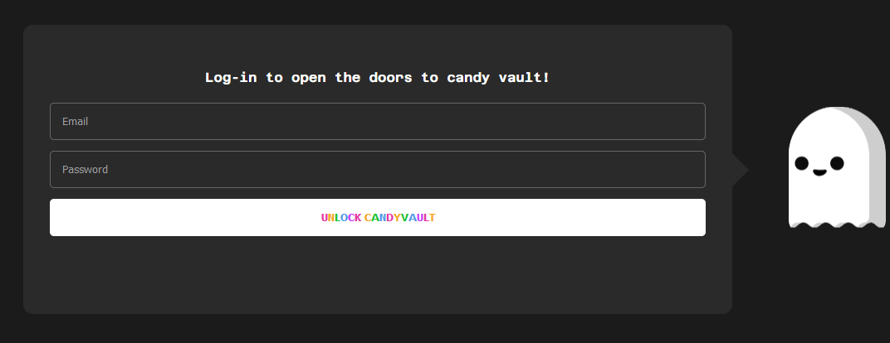

# CandyVault

Iniciei o desafio ao acessar a aplicação web, cuja tela principal era um formulário de login. Em seguida, comecei analisar o código-fonte fornecido pelo próprio _CTF_ para compreender o funcionamento da aplicação.

<figure><figcaption><p>Tela principal</p></figcaption></figure>

```python
@app.route("/login", methods=["POST"])
def login():
    content_type = request.headers.get("Content-Type")

    if content_type == "application/x-www-form-urlencoded":
        email = request.form.get("email")
        password = request.form.get("password")

    elif content_type == "application/json":
        data = request.get_json()
        email = data.get("email")
        password = data.get("password")
    
    else:
        return jsonify({"error": "Unsupported Content-Type"}), 400

    user = users_collection.find_one({"email": email, "password": password})

    if user:
        return render_template("candy.html", flag=open("flag.txt").read())
    else:
        return redirect("/")
```

Ao analisar o código, observei que a aplicação possuía apenas uma rota, e dentro dessa rota, identifiquei uma vulnerabilidade conhecida como _**NoSQL Injection**_.

<figure><figcaption><p>Payload utilizada para conseguir um usuário válido</p></figcaption></figure>

Como era um _**NoSQLi**_ simples, bastou passar os valores dos parâmetros como objetos para utilizar os [operadores ](https://www.mongodb.com/docs/manual/reference/operator/query/)do _MongoDB_ e, dessa forma, fazer autenticação na aplicação.

<figure><figcaption><p>Resposta da após enviar o payload</p></figcaption></figure>

Após realizar o “login”, a aplicação nos fornece a flag. Solved.
