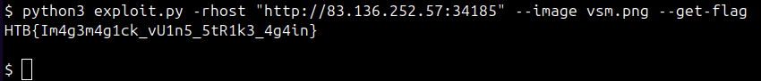

# Prying Eyes

Prying Eyes is a HackTheBox challenge that addresses **CVE-2022-44268** in ImageMagick through argument injection in the application. An autopwn has been created for this challenge.

___
#### How to use:

`rhost` is related to the challenge's IP, where you need to provide `http://` or `https://` + IP. 

The `image` argument is the path of the image where the **CVE-2022-44268** payload is injected.

___
If you just want the flag, you can pass the `get-flag` argument, which will perform all the necessary exploitation and display the flag in the terminal.

Exemple:

```
python3 exploit.py rhost "http://" --image poc.png --get-flag
```



Now, if you want to read a specific file, you can pass the `read-file` argument with the desired file.

Exemple:

```
python3 exploit.py rhost "http://" --image poc.png --read-file "/etc/hosts"
```

